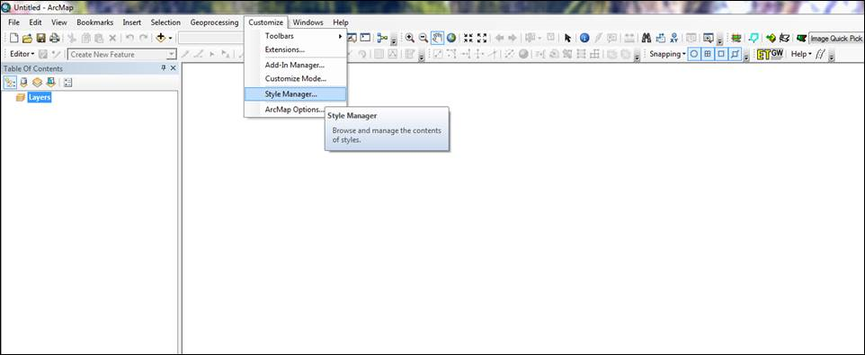
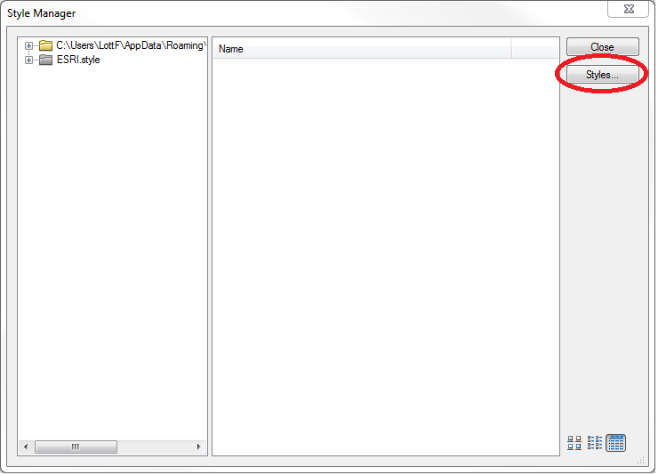
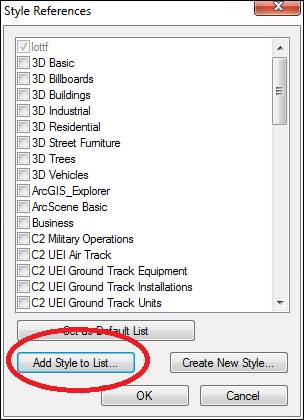

# matplotlib-arcgis
Matplotlib's new default colormaps as a style file for ArcMap/ArcGIS.

For more background and an informational talk, see [this page.](https://bids.github.io/colormap/)

This style file uses the values in https://github.com/BIDS/colormap/blob/master/colormaps.py to build color ramps for ArcGIS.

I used 15 evenly-spaced points along the 256-value colormaps, and assembled them as multi-part algorithmic color ramps using the CIE Lab algorithm. Here's how they turned out:

**Magma:**

**Inferno:**

**Plasma:**

**Viridis:**

## Adding the styles to ArcMap 10.x
Step 1. Go to Customize -> Style Manager...

Step 2. Then "Styles..."

Step 3. Then "Add Style to List..."

Step 4. Select the matplotlib.style file and add it.
